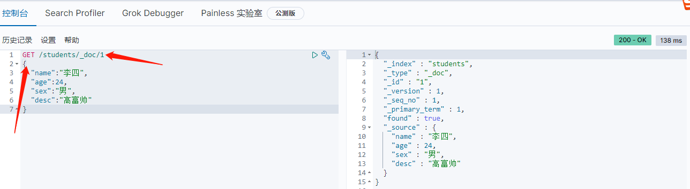

## ElasticSearch 简介
Elasticsearch 是一个基于 [Lucene](https://baike.baidu.com/item/Lucene/6753302) 的搜索服务器。它提供了一个分布式多用户能力的 [全文搜索引擎](https://baike.baidu.com/item/%E5%85%A8%E6%96%87%E6%90%9C%E7%B4%A2%E5%BC%95%E6%93%8E/7847410)，基于 RESTful web 接口。Elasticsearch 是用Java语言开发的，并作为 Apache 许可条款下的开放源码发布，是一种流行的企业级搜索引擎。
Elasticsearch 是与名为 Logstash 的数据收集和日志解析引擎以及名为 Kibana 的分析和可视化平台一起开发的。这三个产品被设计成一个集成解决方案，称为 “Elastic Stack”（以前称为“ELK stack”）。

<!--more-->

### ElasticSearch 概念介绍

Elasticsearch 是面向文档型数据库，一条数据在这里就是一个文档。为了理解，可以将Elasticsearch 里存储文档数据和关系型数据库 MySQL 存储数据的概念进行一个类比


```
Index
　　类似于mysql数据库中的database
Type
　　类似于mysql数据库中的table表，ES中可以在Index中建立type（table），通过mapping进行映射。
Document
　　由于ES存储的数据是文档型的，一条数据对应一篇文档即相当于mysql数据库中的一行数据row，一个文档中可以有多个字段也就是mysql数据库一行可以有多列。
Field
　　ES中一个文档中对应的多个列与mysql数据库中每一列对应
Mapping
　　可以理解为mysql或者solr中对应的schema，只不过有些时候ES中的mapping增加了动态识别功能，感觉很强大的样子，其实实际生产环境上不建议使用，最好还是开始制定好了对应的schema为主。
Query DSL
　　类似于mysql的sql语句，只不过在ES中是使用的json格式的查询语句，专业术语就叫：QueryDSL
GET/PUT/POST/DELETE
　　分别类似与mysql中的select/update/delete......
```

`Elasticsearch 7.X 中, Type 的概念已经被删除了` 本文不在讲述
- 分片：一个物理机器的性能是有瓶颈的，直接往物理机上存数据，存储数量有上限。es 采用了分片的概念，将海量数据切分成片，每一个分片，存储一部分数据。相当于 MySql 的分库, es 在一整个大的集群里，包含很多节点，每个节点又包含很多分片，这样，海量数据由集群来承载。
- 副本（replica）又叫从分片，分片的备份，防止数据丢失。并且当主分片出现物理故障时，从分片顶上去，负责数据的检索等只读请求。从分片的数量可变，不用重新建库。


## Docker-Compose 安装 ElasticSearch
通过 Docker-compose 进行 ElasticSearch 和 Kibana 整合。本文所用案例在 [仓库](https://gitee.com/lijiafei/dnmp) 已经集成，可根据 项目的 `readmi.md` 进行 clone 和使用

### 集成 ElasticSearch
docker-compose.yml 文件
```
elasticsearch:
    build:
      context: ./services/elasticsearch #所用镜像
      args:
        ELASTICSEARCH_VERSION: ${ELASTICSEARCH_VERSION} #所使用的的版本
        ELASTICSEARCH_PLUGINS: ${ELASTICSEARCH_PLUGINS} #需要安装的插件
    container_name: elasticsearch #容器名
    environment: #设置边来你跟
      - TZ=$TZ # 市区设置
      - discovery.type=single-node #单节点模式
      - "ES_JAVA_OPTS=-Xms512m -Xmx512m" #JVM 内存堆大小
    volumes: #文件映射
      - ${DATA_DIR}/esdata:/usr/share/elasticsearch/data
      - ${ELASTICSEARCH_CONF_FILE}:/usr/share/elasticsearch/config/elasticsearch.yml
      - ${ELASTICSEARCH_IK_CONFIG_FILE}:/usr/share/elasticsearch/config/analysis-ik/IKAnalyzer.cfg.xml #IK 分词器的词库配置文件
      - ${ELASTICSEARCH_IK_DIC}:/usr/share/elasticsearch/config/analysis-ik/my.dic #自定义词库文件

    hostname: elasticsearch # 主机名
    restart: always
    ports:
      - "${ELASTICSEARCH_HOST_PORT_C}:9200" # 客户端端口
      - "${ELASTICSEARCH_HOST_PORT_S}:9300" # 服务端端口
    networks: #docker-compose 配置的网络组
      static-network:
```
ElasticSearch 默认安装的 [IK](https://github.com/medcl/elasticsearch-analysis-ik) 分词器，所以先把词库配置文件映射出来，方便自定义词库

.env 文件
```
ELASTICSEARCH_VERSION=7.8.1 # 版本号
ELASTICSEARCH_CONF_FILE=./services/elasticsearch/elasticsearch.yml # es配置文件
ELASTICSEARCH_HOST_PORT_C=9200 #端口
ELASTICSEARCH_HOST_PORT_S=9300 #服务端端口
ELASTICSEARCH_PLUGINS=analysis-ik # es 需要安装的插件
ELASTICSEARCH_IK_CONFIG_FILE=./services/elasticsearch/ik/IKAnalyzer.cfg.xml
ELASTICSEARCH_IK_DIC=./services/elasticsearch/ik/my.dic
```
### 集成 Kibana
Kibana 是一个开源的分析与可视化平台，设计出来用于和 Elasticsearch 一起使用的。你可以用kibana 搜索、查看存放在 Elasticsearch 中的数据。Elasticsearch、Logstash 和 Kibana 这三个技术就是我们常说的ELK技术栈，可以说这三个技术的组合是大数据领域中一个很巧妙的设计。一种很典型的MVC思想，模型持久层，视图层和控制层。Logstash担任控制层的角色，负责搜集和过滤数据。Elasticsearch担任数据持久层的角色，负责储存数据。而 Kibana 担任视图层角色，拥有各种维度的查询和分析，并使用图形化的界面展示存放在 Elasticsearch 中的数据。

docker-compose.yml 文件
```
kibana:
    image: kibana:${KIBANA_VERSION} # 镜像
    container_name: kibana # 容器名
    environment: #参数
      TZ: "$TZ"
      elasticsearch.hosts: http://elasticsearch:9200 # 和 es 进行关联
      I18N_LOCALE: "${KIBANA_I18N_LOCALE}" #语言设置
    hostname: kibana #主机名
    depends_on: # Kibana 启动要取决于 es 是否启动
      - elasticsearch
    restart: always
    ports:
      - "${KIBANA_HOST}:5601"
    networks:
      static-network:
```

.env 文件
```
#
# KIBANA
#
KIBANA_VERSION=7.8.1
KIBANA_HOST=5601
KIBANA_I18N_LOCALE=zh-CN
```

## 运行 ElasticSearch
当集成完毕后，通过 `docker-compose up -d` 来进行启动和后台运行，通过 Docker 客户端可以看到


此时访问本地或服务器的 `9200` 端口可查看 es


运行查看 Kibana，请求本地或服务器的 `5601` 端口，可查看


## 源码安装

### 配置JDK环境

配置环境变量

```
export JAVA_HOME="/opt/jdk1.8.0_144"
export PATH="$JAVA_HOME/bin:$PATH"
export CLASSPATH=".:$JAVA_HOME/lib"
```

### 安装ElasticSearch

```
下载地址：https://www.elastic.co/cn/downloads/elasticsearch
```

启动报错：
`can not run elasticsearch as root`

解决方式：

```
bin/elasticsearch -Des.insecure.allow.root=true
或者修改
bin/elasticsearch，加上ES_JAVA_OPTS属性：
ES_JAVA_OPTS="-Des.insecure.allow.root=true"
```

再次启动：


这是出于系统安全考虑设置的条件。由于ElasticSearch可以接收用户输入的脚本并且执行，为了系统安全考虑，建议创建一个单独的用户用来运行ElasticSearch。

创建用户组和用户：

```
groupadd esgroup
useradd esuser -g esgroup -p espassword
```

更改elasticsearch文件夹及内部文件的所属用户及组：

```
cd /opt
chown -R esuser:esgroup elasticsearch-7.13.3
```

切换用户并运行：

```
su esuser
./bin/elasticsearch
```

再次启动显示已杀死：


需要调整JVM的内存大小：

```
vi bin/elasticsearch
ES_JAVA_OPTS="-Xms512m -Xmx512m"
```

再次启动：启动成功

如果显示如下类似信息：

`[INFO ][o.e.c.r.a.DiskThresholdMonitor] [ZAds5FP] low disk watermark [85%] exceeded on     [ZAds5FPeTY-ZUKjXd7HJKA][ZAds5FP][/opt/elasticsearch-7.13.3/data/nodes/0] free: 1.2gb[14.2%], replicas will not be assigned to this node`

需要清理磁盘空间。

```
后台运行：./bin/elasticsearch -d
测试连接：curl 127.0.0.1:9200
```

会看到一下JSON数据：

```
 [root@localhost ~]# curl 127.0.0.1:9200
  {
  "name" : "PC-202106281820",
  "cluster_name" : "elasticsearch",
  "cluster_uuid" : "S8au4PmBRzmkfdrle9jc3w",
  "version" : {
    "number" : "7.13.3",
    "build_flavor" : "default",
    "build_type" : "zip",
    "build_hash" : "5d21bea28db1e89ecc1f66311ebdec9dc3aa7d64",
    "build_date" : "2021-07-02T12:06:10.804015202Z",
    "build_snapshot" : false,
    "lucene_version" : "8.8.2",
    "minimum_wire_compatibility_version" : "6.8.0",
    "minimum_index_compatibility_version" : "6.0.0-beta1"
  },
  "tagline" : "You Know, for Search"
}

```

实现远程访问： 需要对`config/elasticsearch.yml`进行 配置：`network.host: IP`
再次启动报错：


处理第一个错误：

```
vim /etc/security/limits.conf       //文件最后加入
esuser soft nofile 65536
esuser hard nofile 65536
esuser soft nproc 4096
esuser hard nproc 4096
```

处理第二个错误：

进入`limits.d`目录下修改配置文件。
`vim /etc/security/limits.d/20-nproc.conf `
修改为 `esuser soft nproc 4096`

处理第三个错误：

```
vim /etc/sysctl.conf
vm.max_map_count=655360
```

执行以下命令生效：

```
sysctl -p

关闭防火墙：systemctl stop firewalld.service
```

再次启动成功！

### 安装Kibana

Kibana是一个针对Elasticsearch的开源分析及可视化平台，使用Kibana可以查询、查看并与存储在ES索引的数据进行交互操作，使用Kibana能执行高级的数据分析，并能以图表、表格和地图的形式查看数据

#### 下载Kibana

```
https://www.elastic.co/downloads/kibana
```

(2)把下载好的压缩包拷贝到/soft目录下

(3)解压缩，并把解压后的目录移动到/user/local/kibana

(4)编辑kibana配置文件

```
[root@localhost /]# vi /usr/local/kibana/config/kibana.yml
```

将server.host,elasticsearch.url修改成所在服务器的ip地址

(5)开启5601端口

Kibana的默认端口是5601

开启防火墙:

```
systemctl start firewalld.service
```

开启5601端口:

```
firewall-cmd --permanent --zone=public --add-port=5601/tcp
```

重启防火墙：

```
firewall-cmd –reload
```

(6)启动Kibana

```
[root@localhost /]# /usr/local/kibana/bin/kibana
```

浏览器访问：

```
http://本地:5601  
```

### 安装中文分词器

下载中文分词器

```
https://github.com/medcl/elasticsearch-analysis-ik
下载elasticsearch-analysis-ik-master.zip
```

解压elasticsearch-analysis-ik-master.zip

``` 
unzip elasticsearch-analysis-ik-master.zip
```

进入elasticsearch-analysis-ik-master，编译源码

```
mvn clean install -Dmaven.test.skip=true 
```

在es的plugins文件夹下创建目录ik

将编译后生成的elasticsearch-analysis-ik-版本.zip移动到ik下，并解压

解压后的内容移动到ik目录下


## ElasticSearch 使用
es 是基于 RESTful web 接口，所以根据不同的请求，可进行不同的操作，本文使用 Kibana 工具进行对 es 的访问和使用


### 索引简单基础使用
要是用 es 存储数据，需要先创建一个 `索引` (相当于 MySql 的数据库)
1. 通过 `PUT` 请求创建一个简单的索引
	

2. 通过 `GET` 获取刚创建的索引
	
```json
{
  "user" : { //索引名
    "aliases" : { }, //别名
    "mappings" : { }, //映射
    "settings" : { //设置
      "index" : {
        "creation_date" : "1630057022470", //创建时间
        "number_of_shards" : "1", //分片数量
        "number_of_replicas" : "1", //备份数量
        "uuid" : "cfbmaM-2SM2vr-EvciKUug", //唯一标识
        "version" : {
          "created" : "7080199"
        },
        "provided_name" : "user"
      }
    }
  }
}
```
3. 通过 `DELETE` 方法删除索引
	

### 文档简单基础使用
索引创建好之后，就可以通过接口来创建文档，并添加数据。这里的文档可以类比为关系型数
据库中的表数据，添加的数据格式为 `JSON` 格式

1. 通过 `POST` 方法来创建文档，需加上默认的 type 类型 `_doc`
	
	```
	{
	  "_index" : "students", //索引名
	  "_type" : "_doc", //默认 type 类型
	  "_id" : "-vBqm3sBvfOuEZni9DUz", //生成的唯一id,类比 mysql 的 id
	  "_version" : 1, //版本
	  "result" : "created", //操作结果
	  "_shards" : { //分片
		"total" : 2, //分片总数
		"successful" : 1,
		"failed" : 0
	  },
	  "_seq_no" : 0,
	  "_primary_term" : 1
	}
	```
	上面创建数据后，由于没有指定数据唯一性标识（ID），默认情况下，ES 服务器会随机生成，

2. 创建指定 `id` 的数据，如果有 id，使用 `PUT` 方法也可以
   

3. 通过 `GET` 方法，查看文档,需要带入 id 进行查询
   

4. 通过 `POST` 方法，修改某一个字段的值
   
   

5. 通过 `DELETE` 方法删除文档数据
   
   
   删除一个文档不会立即从磁盘上移除，它只是被标记成已删除（逻辑删除）。当然没有 id，也可以根据查询条件进行删除，后续会说明

## 索引映射
映射是定义文档及其包含的字段如何存储和索引的过程，相当于 MySql 的表字段类型设置。每个文档都是一个字段的集合，每个字段都有自己的 `数据类型`。

映射和索引是一对一的关系。映射分为 `静态映射` 和 `动态映射`。

### 动态映射
静态映射：添加文档时，如果检测到新字段，Elasticsearch会新建该文档字段的特性生成一个动态映射，也就是 Es 自动推断并设置新字段的数据类型等。

字段映射类型和JSON文档字段类型的关系如下：

| JSON数据类型    | ES 推断的数据类型                                            |
| --------------- | ------------------------------------------------------------ |
| null            | 未添加字段                                                   |
| true 或者 false | boolean                                                      |
| double          | float                                                        |
| integer         | long                                                         |
| object          | object                                                       |
| array           | 取决于数组中的第一个非null值                                 |
| string          | 根据字符串内容特征而定，有可能为text/keyword/double/long/date类型等 |

使用 Kibana 向 ES 创建如下文档
```json
PUT /person/_doc/1
{
  "id": 1,
  "name": "张三",
  "height": 180.52,
  "man": true,
  "country": "中国",
  "born": "1950-6-14",
  "child": ["李四", "王五", "赵六"]
}
```
ES 会自动创建 person 索引，并动态映射字段类型

`GET /person/_mapping` 查询索引的映射信息
```json
{
  "person" : {
    "mappings" : {
      "properties" : {
        "born" : {
          "type" : "text",
          "fields" : {
            "keyword" : {
              "type" : "keyword",
              "ignore_above" : 256
            }
          }
        },
        "child" : {
          "type" : "text",
          "fields" : {
            "keyword" : {
              "type" : "keyword",
              "ignore_above" : 256
            }
          }
        },
        "country" : {
          "type" : "text",
          "fields" : {
            "keyword" : {
              "type" : "keyword",
              "ignore_above" : 256
            }
          }
        },
        "height" : {
          "type" : "float"
        },
        "id" : {
          "type" : "long"
        },
        "man" : {
          "type" : "boolean"
        },
        "name" : {
          "type" : "text",
          "fields" : {
            "keyword" : {
              "type" : "keyword",
              "ignore_above" : 256
            }
          }
        }
      }
    }
  }
}
```
可以看到 ES 依据创建的 JSON 数据推断并创建了数据的类型

### 静态映射
既然 ES 能自动推断字段类型，那么也就可以在创建索引的时候，手动进行字段的类型定义，类似于MySQL 的建表操作。
1. 通过 `PUT /students/_mapping` 向 students 索引建立静态映射
```json
PUT /students/_mapping
{
  "properties":{
    "title":{
      "type": "keyword",
      "index": true
    },
    "image":{
      "type":"keyword",
      "index": false
    },
    "content":{
      "type":"text",
      "index":true,
      "analyzer":"ik_max_word"
    },
    "sell":{
      "type":"long"
    }
  }
}
```
	
2. 通过 `GET /students/_mapping` 查看创建的映射信息
```json
{
  "students" : {
    "mappings" : {
      "properties" : {
        "age" : {
          "type" : "long"
        },
        "content" : {
          "type" : "text",
          "analyzer" : "ik_max_word"
        },
        "desc" : {
          "type" : "text",
          "fields" : {
            "keyword" : {
              "type" : "keyword",
              "ignore_above" : 256
            }
          }
        },
        "image" : {
          "type" : "keyword",
          "index" : false
        },
        "name" : {
          "type" : "text",
          "fields" : {
            "keyword" : {
              "type" : "keyword",
              "ignore_above" : 256
            }
          }
        },
        "sell" : {
          "type" : "long"
        },
        "sex" : {
          "type" : "text",
          "fields" : {
            "keyword" : {
              "type" : "keyword",
              "ignore_above" : 256
            }
          }
        },
        "title" : {
          "type" : "keyword"
        }
      }
    }
  }
}
```

关于索引的静态映射，基础的数据有
1. 字段名：任意填写,字段名字
2. type：类型，就是字段类型，Es 支持的字段类型有很多，常用的有
	1. string
		1. text 可分词，字段的内容会被分词器进行分词，然后形成倒排索引
		2. keyword 不可分词，数据会作为完整字段进行匹配
	2. Numerical
		1. 基本数据类型：long、integer、short、byte、double、float、half_float
		2. 浮点数的高精度类型：scaled_float
	3. Date 日期类型
	4. array 数组类型
	5. object 对象类型
3. index：是否索引，默认为 true，也就是说你不进行任何配置，所有字段都会被索引
	true：字段会被索引，则可以用来进行搜索
	false：字段不会被索引，不能用来搜索
4. analyzer：分词器，对这个字段使用那种分词器，这里的 ik_max_word 即使用 ik 分词器

### string 的 text 和 keyword 
**text**
```
1:支持分词，全文检索,支持模糊、精确查询,不支持聚合,排序操作; 2:test类型的最大支持的字符长度无限制,适合大字段存储； 使用场景： 存储全文搜索数据, 例如: 邮箱内容、地址、代码块、博客文章内容等。 默认结合standard analyzer(标准解析器)对文本进行分词、倒排索引。 默认结合标准分析器进行词命中、词频相关度打分。
```
**keyword**
```
1:不进行分词，直接索引,支持模糊、支持精确匹配，支持聚合、排序操作。 2:keyword类型的最大支持的长度为——32766个UTF-8类型的字符,可以通过设置ignore_above指定自持字符长度，超过给定长度后的数据将不被索引，无法通过term精确匹配检索返回结果。 使用场景： 存储邮箱号码、url、name、title，手机号码、主机名、状态码、邮政编码、标签、年龄、性别等数据。 用于筛选数据(例如: select * from x where  status='open')、排序、聚合(统计)。 直接将完整的文本保存到倒排索引中。
```
text 类型的数据会把内容 `先进行分词`，然后再 `再存入` 到es中。
keyword：不分词，没有数据内容进行分词处理，而是存入了整个数据！

#### 案列说明
1. 创建 test 索引 `PUT /test`
2. 创建静态映射，映射两个字段 `title:keyword`,`content:text`
	```json
	PUT /test/_mapping
	{
	 "properties":{
    "title":{
      "type": "keyword",
      "index": true
    },
    "content":{
      "type":"text",
      "index":true,
      "analyzer":"ik_max_word"
    }
    }
	}
	```
3. 创建文档，存入数据
```json
PUT /test/_doc/1
{
  "title":"分布式，高扩展，高实时",
  "content":"Elasticsearch 是一个分布式,高扩展,高实时的搜索与数据分析引擎"
}
```
4. 通过全部内容进行匹配查询，查询 content
	```
	GET /test/_doc/_search
	{
    "query":{
    "term":{
      "content":"Elasticsearch 是一个分布式,高扩展,高实时的搜索与数据分析引擎"
    }
    }
	}
# 查询结果
```json
{
  "took" : 0,
  "timed_out" : false,
  "_shards" : {
    "total" : 1,
    "successful" : 1,
    "skipped" : 0,
    "failed" : 0
  },
  "hits" : {
    "total" : {
      "value" : 0,
      "relation" : "eq"
    },
    "max_score" : null,
    "hits" : [ ]
  }
}
```

```
可以看到查询数据为空
使用 title 查询
```
```json
GET /test/_doc/_search
{
  "query":{
    "term":{
      "title":"分布式，高扩展，高实时"
    }
  }
}
```


# 查询结果
```json
{
  "took" : 0,
  "timed_out" : false,
  "_shards" : {
    "total" : 1,
    "successful" : 1,
    "skipped" : 0,
    "failed" : 0
  },
  "hits" : {
    "total" : {
      "value" : 1,
      "relation" : "eq"
    },
    "max_score" : 0.2876821,
    "hits" : [
      {
        "_index" : "test",
        "_type" : "_doc",
        "_id" : "1",
        "_score" : 0.2876821,
        "_source" : {
          "title" : "分布式，高扩展，高实时",
          "content" : "Elasticsearch 是一个分布式,高扩展,高实时的搜索与数据分析引擎"
        }
      }
    ]
  }
}
```

> 可看到对 `content` 的 `text` 类型进行全部内容匹配查不到数据，而对 `title` 的 `keyword` 类型进行全部内容匹配成功查到数据.

> 可通过 `GET /test/_analyze` 查看这条数据在存入 es 的时候分词情况:

```json
GET /test/_analyze
{
  "field": "title",
  "text":"分布式，高扩展，高实时"
}
//分词结果
{
  "tokens" : [
    {
      "token" : "分布式，高扩展，高实时",
      "start_offset" : 0,
      "end_offset" : 11,
      "type" : "word",
      "position" : 0
    }
  ]
}
```

> 存储数据的时候不会对 title 的内容进行分词，而是全部内容存入 es.

> 查看 content 存入情况:

```json
GET /test/_analyze
{
  "field": "content",
  "text":"Elasticsearch 是一个分布式,高扩展,高实时的搜索与数据分析引擎"
}
//分词结果
{
  "tokens" : [
    {
      "token" : "elasticsearch",
      "start_offset" : 0,
      "end_offset" : 13,
      "type" : "ENGLISH",
      "position" : 0
    },
    {
      "token" : "是",
      "start_offset" : 14,
      "end_offset" : 15,
      "type" : "CN_CHAR",
      "position" : 1
    },
    {
      "token" : "一个",
      "start_offset" : 15,
      "end_offset" : 17,
      "type" : "CN_WORD",
      "position" : 2
    },
    {
      "token" : "一",
      "start_offset" : 15,
      "end_offset" : 16,
      "type" : "TYPE_CNUM",
      "position" : 3
    },
    {
      "token" : "个",
      "start_offset" : 16,
      "end_offset" : 17,
      "type" : "COUNT",
      "position" : 4
    },
    {
      "token" : "分布式",
      "start_offset" : 17,
      "end_offset" : 20,
      "type" : "CN_WORD",
      "position" : 5
    },
    {
      "token" : "分布",
      "start_offset" : 17,
      "end_offset" : 19,
      "type" : "CN_WORD",
      "position" : 6
    },
    {
      "token" : "式",
      "start_offset" : 19,
      "end_offset" : 20,
      "type" : "CN_CHAR",
      "position" : 7
    },
    {
      "token" : "高",
      "start_offset" : 21,
      "end_offset" : 22,
      "type" : "CN_CHAR",
      "position" : 8
    },
    {
      "token" : "扩展",
      "start_offset" : 22,
      "end_offset" : 24,
      "type" : "CN_WORD",
      "position" : 9
    },
    {
      "token" : "高",
      "start_offset" : 25,
      "end_offset" : 26,
      "type" : "CN_CHAR",
      "position" : 10
    },
    {
      "token" : "实时",
      "start_offset" : 26,
      "end_offset" : 28,
      "type" : "CN_WORD",
      "position" : 11
    },
    {
      "token" : "的",
      "start_offset" : 28,
      "end_offset" : 29,
      "type" : "CN_CHAR",
      "position" : 12
    },
    {
      "token" : "搜索",
      "start_offset" : 29,
      "end_offset" : 31,
      "type" : "CN_WORD",
      "position" : 13
    },
    {
      "token" : "与",
      "start_offset" : 31,
      "end_offset" : 32,
      "type" : "CN_CHAR",
      "position" : 14
    },
    {
      "token" : "数据",
      "start_offset" : 32,
      "end_offset" : 34,
      "type" : "CN_WORD",
      "position" : 15
    },
    {
      "token" : "据分析",
      "start_offset" : 33,
      "end_offset" : 36,
      "type" : "CN_WORD",
      "position" : 16
    },
    {
      "token" : "分析",
      "start_offset" : 34,
      "end_offset" : 36,
      "type" : "CN_WORD",
      "position" : 17
    },
    {
      "token" : "引擎",
      "start_offset" : 36,
      "end_offset" : 38,
      "type" : "CN_WORD",
      "position" : 18
    }
  ]
}
```

> 对 `content` 的内容会先进行分词，在存储，所以使用全内容进行匹配时，在 es 中是找不到的 ,  `ElasticSearch` 的使用是最最最基本的。
