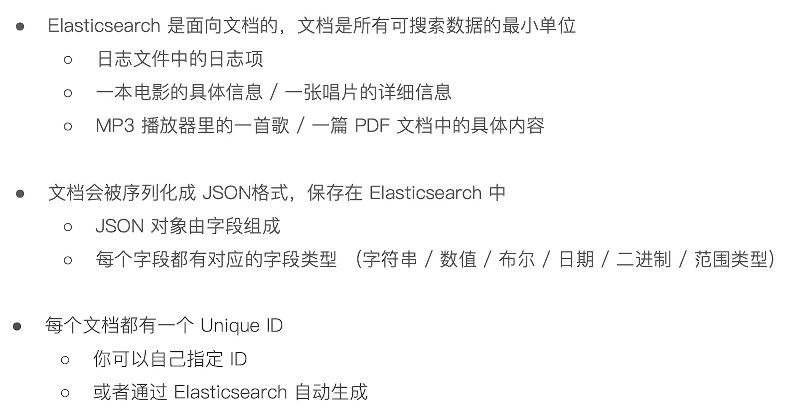

# Elasticsearch简介

​    Elasticsearch是一个基于[Lucene](https://baike.baidu.com/item/Lucene/6753302)的搜索服务器。它提供了一个分布式多用户能力的[全文搜索引擎](https://baike.baidu.com/item/全文搜索引擎/7847410)，基于RESTful web接口。Elasticsearch是用Java语言开发的，并作为Apache许可条款下的开放源码发布，是一种流行的企业级搜索引擎。Elasticsearch用于[云计算](https://baike.baidu.com/item/云计算/9969353)中，能够达到实时搜索，稳定，可靠，快速，安装使用方便。官方客户端在Java、.NET（C#）、PHP、Python、Apache Groovy、Ruby和许多其他语言中都是可用的。根据DB-Engines的排名显示，Elasticsearch是最受欢迎的企业搜索引擎，其次是Apache Solr，也是基于Lucene。

​    Elasticsearch 是与名为 Logstash 的数据收集和日志解析引擎以及名为 Kibana 的分析和可视化平台一起开发的。这三个产品被设计成一个集成解决方案，称为 “Elastic Stack”（以前称为“ELK stack”）

## Elasticsearch概念介绍

​    Elasticsearch 是面向文档型数据库，一条数据在这里就是一个文档。为了理解，可以将Elasticsearch 里存储文档数据和关系型数据库 (RDBMS) 存储数据的概念进行一个类比


## Elasticsearch中的文档



## 文档元数据


## Elasticsearch 字段类型


**注：字符串类型string已经弃用**

字符串类型ElasticSearch对字符串拥有两种完全不同的搜索方式，你可以按照整个文本进行匹配，即关键词搜索(keyword search)，也可以按单个字符匹配，即全文搜索(full-text search)， 前者的字符串被称为not-analyzed字符, 而后者被称作analyzed字符串

```json
text：
会分词，然后进行索引
支持模糊、精确查询
不支持聚合

keyword：
不进行分词，直接索引
支持模糊、精确查询
支持聚合
```

## RESTAPI 可以很容易的被各种语言调用


# Elaticsearch及相关环境安装(使用Docker/Docker-Compose)

```yaml
version: "3.4"
services:
  elasticsearch:
    image: docker.elastic.co/elasticsearch/elasticsearch:7.17.3
    container_name: elasticsearch
    environment:
      - 'discovery.type=single-node'
      - 'xpack.security.enabled=false'
      - 'ES_JAVA_OPTS=-Xms256m -Xmx256m'
    volumes:
      - '/conf/elastic/data:/usr/share/elasticsearch/data'
      - '/conf/elastic/plugins:/usr/share/elasticsearch/plugins'
      - '/conf/elastic/elasticsearch.yml:/usr/share/elasticsearch/config/elasticsearch.yml'
    ports:
      - '9200:9200'
      - '9300:9300'
    restart: unless-stopped
    networks:
      worker:
        ipv4_address: 10.10.0.2

  kibana:
    image: docker.elastic.co/kibana/kibana:7.17.3
    container_name: kibana
    volumes:
      - '/conf/kibana/kibana.yml:/usr/share/kibana/config/kibana.yml'
    ports:
      - '5601:5601'
    restart: unless-stopped
    networks:
      worker:
        ipv4_address: 10.10.0.3

  mysql:
    image: mysql
    container_name: mysql
    environment:
      - 'MYSQL_ROOT_PASSWORD=123456'
      - 'LANG=C.UTF-8'
    volumes:
      - '/conf/mysql/my.cnf:/etc/mysql/my.cnf'
    ports:
      - '3306:3306'
    restart: unless-stopped
    command: '--default-authentication-plugin=mysql_native_password'
    networks:
      worker:
        ipv4_address: 10.10.0.4

  canal:
    image: canal/canal-server:latest
    container_name: canal
    volumes:
      - '/conf/canal/canal.properties:/home/admin/canal-server/conf/canal.properties'
      - '/conf/canal/instance.properties:/home/admin/canal-server/conf/example/instance.properties'
    ports:
      - '11111:11111'
    restart: unless-stopped
    networks:
      worker:
        ipv4_address: 10.10.0.5

  rabbitmq:
    image: rabbitmq:3-management
    container_name: rabbitmq
    environment:
      - 'RABBITMQ_DEFAULT_USER=admin'
      - 'RABBITMQ_DEFAULT_PASS=admin'
    ports:
      - '5672:5672'
      - '15672:15672'
    restart: unless-stopped
    networks:
      worker:
        ipv4_address: 10.10.0.6

networks:
    worker:
      ipam:
        driver: default
        config:
          - subnet: 10.10.0.0/24
```

# 同步MYSQL数据到Elasticsearch

## 方案一：使用Logstash

*   **优点：Elastic官方工具，支持全量、增量同步，不需要写任何代码，对业务代码没有侵入**

*   **缺点：不支持数据删除操作的同步，采用定时轮询的方式SQL查询增量数据同步到ES，对数据库有一定压力**

logstash同步配置文件(jdbc.conf)：

```json
input {

    stdin {}

    jdbc {
        # `type`与下方output中的`type`相对应
        type => "demo_kg_goods_coalition"
        # 数据库链接
        jdbc_connection_string => "jdbc:mysql://192.178.11.2:3306/demo?serverTimezone=Asia/Shanghai&useUnicode=true&characterEncoding=utf8&useSSL=false"
        # 账号
        jdbc_user => "root"
        # 密码
        jdbc_password => "123456"
        # mysql驱动 需要把mysql驱动的jar包放到logstash根目录中的logstash-core\lib\jars文件夹中
        jdbc_driver_class => "com.mysql.cj.jdbc.Driver"
        jdbc_default_timezone =>"Asia/Shanghai"
        # 数据库重连尝试次数
        connection_retry_attempts => "3"
        # 是否校验数据库连接
        jdbc_validate_connection => "true"
        # 超时时间
        jdbc_validation_timeout => "3600"
        # 是否分页查询
        jdbc_paging_enabled => "true"
        # 分页每页数据数量
        jdbc_page_size => "500"
        # 查询增量数据执行的SQL脚本(sql如果很复杂可以写在`xx.sql`文件中 使用`statement_filepath`配置sql文件路径)
        statement => "SELECT * FROM `kg_goods_coalition` WHERE updated_at > :sql_last_value AND updated_at < NOW()"
        # 是否转换字段名小写
        lowercase_column_names => false
        sql_log_level => warn   
        # 是否记录上次执行结果,如果为true,将会把上次执行到的`tracking_column`字段的值记录下来,保存到`last_run_metadata_path`指定的文件中
        record_last_run => true
        # 是否需要记录某个column的值,如果`record_last_run`为true,可以自定义我们需要表的字段名称
        use_column_value => true
        # 如果`use_column_value`为真,需配置此参数.这个参数就是数据库给出的一个字段名称.当然该字段必须是递增的可以是数据库的数据修改时间、递增主键这类的
        tracking_column => "updated_at"
        # `tracking_column`字段类型,如果是数字类型的字段配置为`numeric`
        tracking_column_type => "timestamp"
        # 指定文件中记录上次执行到的`tracking_column`字段的值
        last_run_metadata_path => "./mysql/record/kg_goods_coalition_id.txt"
        # 若配置为true则会清除上次同步记录的文件,重新启动进行全表同步
        clean_run => false
        # 定时器 扫表间隔时间 3秒一次
        schedule => "*/3 * * * * *"
    }

}

filter {

    json {
        source => "message"
    }

    mutate {

        # 删除无用的字段
        remove_field => ["@type", "@timestamp", "@version", "message", "_class"]

        # 字段类型转换
        convert => {
          # "name" => "string"
        }

    }

}

output {

    # `type`对应上方jdbc配置的`type` 指定同步数据到哪个ES的哪个索引中
    if [type] == "demo_kg_goods_coalition" {
        elasticsearch {
            # ES地址
            hosts => ["192.178.11.2:9200"]
            # 索引名
            index => "kg_goods_coalition"
            # `%{field}` field为表中主键的字段
            document_id => "%{coalition_id}"
        }
    }

    stdout {
        # codec => json_lines
        codec => rubydebug
    }

}
```

创建好索引结构后，windows下运行以下命令启动logstash：

```bash
.\bin\logstash.bat -f .\mysql\jdbc.conf
```

注意事项：

*   **注意MySQL中的时间与实际时间不能有偏差**

    ```bash
    docker cp /usr/share/zoneinfo/Asia/Shanghai mysql:/etc/localtime
    ```

*   **如果`tracking_column`的字段是更新时间，那么表中该字段需要设置数据库自动维护自动更新**

    ```sql
    `updated_at` datetime DEFAULT CURRENT_TIMESTAMP ON UPDATE CURRENT_TIMESTAMP COMMENT '更新时间'
    ```

*   **业务代码中最好不要去手动操作更新时间**

*   **同步表需要逻辑删除，物理删除导致查询数据错误**

## 方案二：使用Canal、RabbitMQ

*   **优点：监听MySQL的binlog日志，几乎实时同步，支持增量同步增、删、改都可以，监听的binlog日志，几乎对数据库没有压力，对业务代码没有侵入**

*   **缺点：不支持全量同步，需要编写同步代码，需要配合MQ或者其它技术来保证可靠性**

首先设置MYSQL开启binlog日志：

登录MYSQL查看binlog开启状态，执行：SHOW VARIABLES LIKE 'log\_bin'; SHOW VARIABLES LIKE 'binlog_format%';

*   OFF：关闭

*   ON：开启

修改`/etc/mysql/my.cnf`，在\[mysqld]下添加配置

```properties
[mysqld]
pid-file        = /var/run/mysqld/mysqld.pid
socket          = /var/run/mysqld/mysqld.sock
datadir         = /var/lib/mysql
secure-file-priv= NULL

# 以下是添加的配置
server-id=1
log-bin=mysql-bin
binlog-format=ROW
```

在MYSQL中添加一个canal用户并赋予权限

```bash
CREATE USER 'canal'@'%' IDENTIFIED BY 'canal';
GRANT SHOW VIEW, SELECT, REPLICATION SLAVE, REPLICATION CLIENT ON *.* TO 'canal'@'%';
FLUSH PRIVILEGES;
```

修改canal中的两个配置文件`canal-server/conf/canal.properties`、`canal-server/conf/example/instance.properties`

canal.properties:

```properties
# tcp, kafka, rocketMQ, rabbitMQ
canal.serverMode = rabbitMQ

rabbitmq.host = 10.10.0.6
rabbitmq.virtual.host = demo
rabbitmq.exchange = business.data.topic
rabbitmq.username = admin
rabbitmq.password = admin
rabbitmq.deliveryMode = topic
```

instance.properties

```properties
# 需要改成之前配置的数据库连接
canal.instance.master.address=10.10.0.4:3306

# 改成之前创建的用户账号、密码
canal.instance.dbUsername=canal
canal.instance.dbPassword=canal

# 此配置作用是监听同步的数据库表规则 .*\\..*表示全部库全部表 demo\\..*表示demo库下的全部表
canal.instance.filter.regex=demo\\..*

# 队列绑定交换机的routingkey
canal.mq.topic=imaXsdIksOlsPny
```

最后，客户端编写代码接收MQ消息后，使用RESTAPI同步数据到Elatsicsearch

canal监听发送的消息结构：

```json
{
    "data":[
        {
            "coalition_id":"2072",
            "goods_id":"48",
            "goods_type":"3",
            "goods_title":"全国专升本－管理学",
            "goods_img":"/history_img/course/154238602730764.jpg",
            "goods_price":"537.0",
            "goods_discount_price":"358.0",
            "cate_id":"1",
            "region_id":"9",
            "subject_id":"3",
            "created_at":"2015-12-08 18:50:04",
            "updated_at":"2022-08-03 11:45:23",
            "deleted_at":null
        }
    ],
    "database":"demo",
    "es":1659498323000,
    "id":3,
    "isDdl":false,
    "mysqlType":{
        "coalition_id":"varchar(36)",
        "goods_id":"varchar(36)",
        "goods_type":"tinyint unsigned",
        "goods_title":"varchar(100)",
        "goods_img":"varchar(100)",
        "goods_price":"decimal(10,2) unsigned",
        "goods_discount_price":"decimal(10,2) unsigned",
        "cate_id":"bigint unsigned",
        "region_id":"bigint unsigned",
        "subject_id":"varchar(36)",
        "created_at":"datetime",
        "updated_at":"datetime",
        "deleted_at":"datetime"
    },
    "old":[
        {
            "goods_title":"全国专升本－管理学1",
            "updated_at":"2022-08-03 11:45:04"
        }
    ],
    "pkNames":[
        "coalition_id"
    ],
    "sql":"",
    "sqlType":{
        "coalition_id":12,
        "goods_id":12,
        "goods_type":-6,
        "goods_title":12,
        "goods_img":12,
        "goods_price":3,
        "goods_discount_price":3,
        "cate_id":-5,
        "region_id":-5,
        "subject_id":12,
        "created_at":93,
        "updated_at":93,
        "deleted_at":93
    },
    "table":"kg_goods_coalition",
    "ts":1659498323977,
    "type":"UPDATE"
}
```

## 方案三：在业务代码中同时操作MYSQL、Elasticsearch

*   **同步：操作MYSQL之后使用RESTAPI去操作Elasticsearch同步变更，使用http请求的方式**

*   **异步：操作MYSQL之后，变更通过MQ发送出去，在消费端操作Elasticsearch同步变更**

对业务代码都有侵入，每次业务新增功能都需要编写新的同步代码，不推荐使用

# 使用Kibana操作Elasticsearch

## 索引信息查询

```json
# 查询索引状态
GET /_cat/indices

# 查询指定索引的Mapping结构
GET /kg_goods_coalition/_mapping

# 查询指定索引setting
GET /kg_goods_coalition/_settings
```

## 简单查询

```json
# count查询 获取文档数量
GET /kg_goods_coalition/_count

# 查询索引中所有数据
GET /kg_goods_coalition/_search
{
  "query": {
    "match_all": {}
  }
}

# 精准查询某字段 类似mysql中的`=`
# select * from kg_goods_coalition where goods_title = '中级会计职称经济法串讲课'
GET /kg_goods_coalition/_search
{
  "query": {
    "term": {
      "goods_title.keyword": {
        "value": "中级会计职称经济法串讲课"
      }
    }
  }
}

# select * from kg_goods_coalition where coalition_id = 3023
GET /kg_goods_coalition/_search
{
  "query": {
    "term": {
      "coalition_id": {
        "value": 3023
      }
    }
  }
}

# select * from kg_goods_coalition where coalition_id in (3025,3026)
GET /kg_goods_coalition/_search
{
  "query": {
    "terms": {
      "coalition_id": [
        3025,
        3026
      ]
    }
  }
}

# 模糊匹配 类似mysql中的`like`
# select * from kg_goods_coalition where goods_title like '%计算机基础精讲%'
GET /kg_goods_coalition/_search
{
  "query": {
    "wildcard": {
      "goods_title.keyword": {
        "value": "*计算机基础精讲*"
      }
    }
  }
}

# 范围查询(gt大于 gte大于等于 lt小于 lte小于等于)
# 查询商品价格范围在100~200之间的数据
GET /kg_goods_coalition/_search
{
  "query": {
    "range": {
      "goods_price": {
        "gte": 100,
        "lte": 200
      }
    }
  }
}

# bool多条件查询 must必须 must_not必须不 类似mysql中的and和!=
# select * from kg_goods_coalition where goods_title like '%语文%' and goods_price > 100 and cate_id != 1
# 查询标题包含语文、商品价格大于200且商品一级分类非专升本的商品
GET /kg_goods_coalition/_search
{
  "query": {
    "bool": {
      "must": [
        {
          "range": {
            "goods_price": {
              "gt": 100
            }
          }
        },
        {
          "wildcard": {
            "goods_title.keyword": {
              "value": "*语文*"
            }
          }
        }
      ],
      "must_not": [
        {
          "term": {
            "cate_id": {
              "value": 1
            }
          }
        }
      ]
    }
  }
}

# should类似mysql中的or
# select * from kg_goods_coalition where goods_title like '%语文%' or goods_title like '%数学%'
GET /kg_goods_coalition/_search
{
  "query": {
    "bool": {
      "should": [
        {
          "wildcard": {
            "goods_title.keyword": {
              "value": "*数学*"
            }
          }
        },
        {
          "wildcard": {
            "goods_title.keyword": {
              "value": "*语文*"
            }
          }
        }
      ]
    }
  }
}

# 分页查询 from查询起始位置 size每页数据数量 sort排序字段
GET /kg_goods_coalition/_search
{
  "from": 0,
  "size": 3, 
  "query": {
    "match_all": {}
  },
  "sort": [
    {
      "created_at": {
        "order": "desc"
      }
    }
  ]
}
```

注意事项：

*   **ES中默认的分页查询在深度分页情况下效率会变低，且默认的分页限制是from+size大小1w，大于 1w会报错**

    ```js
    # 设置max_result_window大于1w
    "max_result_window" : 100000
    ```

*   **bool多条件查询中，当should与must共存时should失效的问题**

    ```json
    {
        "query": {
            "bool": {
                "must": [
                    {"term": {"color": "red"}}
                ],
                # 当must存在的时候，should中的条件是可有可无的，就是must条件满足就行，should的一个都不用满足也可以
                # 当must不存在的时候，should中的条件至少要满足一个
                "should": {
                    {"term": {"size": 33}},
                    {"term": {"size": 55}}
                },
                # 所以当must存在，又想让should的条件至少满足一个地加这个参数
                "minimum_should_match":1
            }
        }
    }
    ```

## 分词查询

Elasticsearch默认不支持中文分词，对中文进行分词需要引入中文分词器，这里使用ik分词器，放入`elasticsearch/plugins`目录下

Github下载地址：<https://github.com/medcl/elasticsearch-analysis-ik/>  注意下载与Elasticsearch相对应的版本

```json
# 默认分词器 对英文分词
# 切分过程中不会忽略停止词(如：the、a、an等) 会进行单词的大小写转换、过滤连接符或括号等常见符号
GET /_analyze
{
  "analyzer": "standard",
  "text": ["2019年江西专升本英语基础精讲课"]
}

# 最粗粒度
GET /_analyze
{
  "analyzer": "ik_smart",
  "text": ["2019年江西专升本英语基础精讲课"]
}

# 最细粒度
GET /_analyze
{
  "analyzer": "ik_max_word",
  "text": ["2019年江西专升本英语基础精讲课"]
}

# 分词
GET /kg_goods_coalition/_search
{
  "query": {
    "match": {
      "goods_title": "2019年江西专升本英语基础精讲课"
    }
  }
}

# 分词高亮
GET /kg_goods_coalition/_search
{
  "query": {
    "match": {
      "goods_title": "2019年江西专升本英语基础精讲课"
    }
  },
  "highlight": {
    "pre_tags": ["<span style='color: red;'>"],
    "post_tags": ["</span>"],
    "fields": {
      "goods_title": {}
    }
  }
}
```

# 集成SpingBoot调用查询API

pom.xml引入依赖

```xml
<dependency>
    <groupId>org.springframework.boot</groupId>
    <artifactId>spring-boot-starter-data-elasticsearch</artifactId>
</dependency>
```

application.yml添加配置

```yml
spring:
	elasticsearch:
    	uris: http://121.5.14.227:9200
```

创建索引对象，项目启动时会在Elasticsearch中自动创建索引结构，对应Elasticsearch中mapping、setting

```java
package com.example.demo.entity;

import com.fasterxml.jackson.annotation.JsonFormat;
import lombok.Data;
import org.springframework.data.annotation.Id;
import org.springframework.data.elasticsearch.annotations.*;

import java.util.Date;

@Data
@Document(indexName = "t_user")
@Setting(replicas = 0)
public class User {

    /**
     * id
     */
    @Id
    @Field(name = "id", type = FieldType.Keyword)
    private String id;

    /**
     * 姓名
     */
    @Field(name = "name", type = FieldType.Keyword)
    private String name;

    /**
     * 年龄
     */
    @Field(name = "age", type = FieldType.Integer)
    private Integer age;

    /**
     * 地址 支持分词、模糊、精准查询
     */
    @MultiField(mainField = @Field(name = "address", type = FieldType.Text, analyzer = "ik_max_word", searchAnalyzer = "ik_smart"), otherFields = {@InnerField(type = FieldType.Keyword, suffix = "keyword")})
    private String address;

    /**
     * 创建时间
     */
    @Field(name = "created_at", type = FieldType.Date, pattern = "yyyy-MM-dd'T'HH:mm:ss.SSS'Z'")
    @JsonFormat(shape = JsonFormat.Shape.STRING)
    private Date createdAt;

    /**
     * 更新时间
     */
    @Field(name = "updated_at", type = FieldType.Date, pattern = "yyyy-MM-dd'T'HH:mm:ss.SSS'Z'")
    @JsonFormat(shape = JsonFormat.Shape.STRING)
    private Date updatedAt;

}
```

创建UserRepository接口继承ElasticsearchRepository接口，ElasticsearchRepository接口中提供了索引的curd方法可直接调用

```java
package com.example.demo.repository;

import com.example.demo.entity.User;
import org.springframework.data.elasticsearch.repository.ElasticsearchRepository;
import org.springframework.stereotype.Repository;

@Repository
public interface UserRepository extends ElasticsearchRepository<User, String> {
    
}
```

也可以在里边自己写查询方法

```java
package com.example.demo.repository;

import com.example.demo.entity.User;
import org.springframework.data.elasticsearch.repository.ElasticsearchRepository;
import org.springframework.stereotype.Repository;

import java.util.List;

@Repository
public interface UserRepository extends ElasticsearchRepository<User, String> {

    List<User> findByName(String name);

    List<User> findByNameContaining(String name);

    List<User> findByNameAndAddressContaining(String name, String addressKeywords);

    List<User> findByAgeIn(List<Integer> ages);

    List<User> findByAgeBetween(Integer min, Integer max);

}
```

使用ElasticsearchRestTemplate查询

```java
package com.example.demo.controller;

import com.example.demo.entity.User;
import com.example.demo.repository.UserRepository;
import com.example.demo.utils.SearchUtils;
import org.elasticsearch.index.query.BoolQueryBuilder;
import org.elasticsearch.index.query.QueryBuilders;
import org.elasticsearch.search.sort.FieldSortBuilder;
import org.elasticsearch.search.sort.SortBuilders;
import org.elasticsearch.search.sort.SortOrder;
import org.springframework.data.domain.PageRequest;
import org.springframework.data.domain.Pageable;
import org.springframework.data.elasticsearch.core.ElasticsearchRestTemplate;
import org.springframework.data.elasticsearch.core.SearchHit;
import org.springframework.data.elasticsearch.core.SearchHits;
import org.springframework.data.elasticsearch.core.query.NativeSearchQueryBuilder;
import org.springframework.util.CollectionUtils;
import org.springframework.web.bind.annotation.GetMapping;
import org.springframework.web.bind.annotation.RequestMapping;
import org.springframework.web.bind.annotation.RequestParam;
import org.springframework.web.bind.annotation.RestController;

import javax.annotation.Resource;
import java.util.Arrays;
import java.util.HashMap;
import java.util.List;
import java.util.Map;
import java.util.stream.Collectors;

@RestController
@RequestMapping("/user")
public class UserController {

    @Resource
    private ElasticsearchRestTemplate restTemplate;

    @GetMapping("/page")
    public Map<String, Object> page(@RequestParam Integer page, @RequestParam Integer pageSize) {
        //PageRequest中分页是从0开始的 0代表第一页 后边以此类推
        page = page < 1 ? 0 : page - 1;
        Pageable pageable = PageRequest.of(page, pageSize);
        SortOrder sortOrder = SortOrder.DESC;
        FieldSortBuilder sortBuilder = SortBuilders.fieldSort("created_at").order(sortOrder);
        NativeSearchQueryBuilder searchQueryBuilder = new NativeSearchQueryBuilder()
                .withPageable(pageable)
                .withSorts(sortBuilder);
        SearchHits<User> searchHits = restTemplate.search(searchQueryBuilder.build(), User.class);
        List<User> users = searchHits.stream().map(SearchHit::getContent).collect(Collectors.toList());
        Map<String, Object> pageMap = new HashMap<>();
        pageMap.put("list", users);
        pageMap.put("count", searchHits.getTotalHits());
        return pageMap;
    }

    @GetMapping("/pageHighLight")
    public Map<String, Object> pageHighLight(@RequestParam Integer page, @RequestParam Integer pageSize, @RequestParam String keywords) {
        //PageRequest中分页是从0开始的 0代表第一页 后边以此类推
        page = page < 1 ? 0 : page - 1;
        Pageable pageable = PageRequest.of(page, pageSize);
        SortOrder sortOrder = SortOrder.DESC;
        FieldSortBuilder sortBuilder = SortBuilders.fieldSort("created_at").order(sortOrder);
        //使用match分词查询address字段
        BoolQueryBuilder boolQueryBuilder = QueryBuilders.boolQuery()
                .must(QueryBuilders.matchQuery("address", keywords));
        NativeSearchQueryBuilder searchQueryBuilder = new NativeSearchQueryBuilder()
                .withQuery(boolQueryBuilder)
                .withPageable(pageable)
                .withSorts(sortBuilder)
                .withHighlightBuilder(SearchUtils.buildHighlight("address"));
        SearchHits<User> searchHits = restTemplate.search(searchQueryBuilder.build(), User.class);
        //替换高亮字段
        List<User> users = searchHits.stream().map(searchHit -> {
            //高亮的内容
            Map<String, List<String>> highlightFields = searchHit.getHighlightFields();
            //将高亮的内容填充到content中
            searchHit.getContent().setAddress(CollectionUtils.isEmpty(highlightFields.get("address")) ? searchHit.getContent().getAddress() : highlightFields.get("address").get(0));
            return searchHit.getContent();
        }).collect(Collectors.toList());
        Map<String, Object> pageMap = new HashMap<>();
        pageMap.put("list", users);
        pageMap.put("count", searchHits.getTotalHits());
        return pageMap;
    }

}
```

# 其他

*   **多个索引之间关联关系处理**

    [关联关系处理 | Elasticsearch: 权威指南 | Elastic](https://www.elastic.co/guide/cn/elasticsearch/guide/current/relations.html)

    [对象 | Elasticsearch: 权威指南 | Elastic](https://www.elastic.co/guide/cn/elasticsearch/guide/current/nested-objects.html)

    [子关系文档 | Elasticsearch: 权威指南 | Elastic](https://www.elastic.co/guide/cn/elasticsearch/guide/current/parent-child.html)

*   **聚合查询**

    [聚合 | Elasticsearch: 权威指南 | Elastic](https://www.elastic.co/guide/cn/elasticsearch/guide/current/aggregations.html)

*   **关于倒排索引**

    [信息检索——简单易懂的倒排索引（原理+例子）\_土豆同学的博客-CSDN博客\_倒排索引](https://blog.csdn.net/qq_43403025/article/details/114779166)
